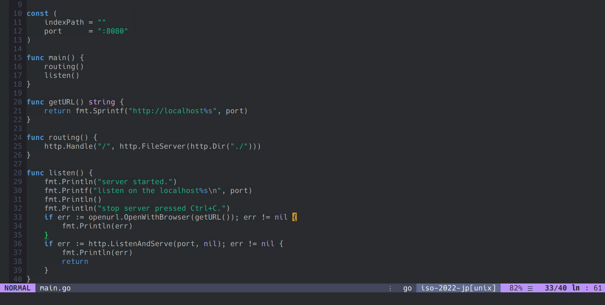

# go-openurl

<p align="center">
    
</p>

go-openurl is library for golang that opens url with default browser.

## Usage

### Install

```bash
go get -u github.com/yasukotelin/go-openurl
```

and you import into the source.

```go
import "github.com/yasukotelin/go-openurl"
```

### Call the function

You can open the browser specified url easily😋.

```go
func main() {
	openurl.OpenWithBrowser("https://vim-jp.org/")
}
```

